<div align="center">


**基于RPI和有效上下文理论，让Claude Code一次只专注于一件事**

[](https://opensource.org/licenses/MIT) [](https://claude.ai/code) [](https://x.com/intent/tweet?text=GudaStudio%20Commands：Claude%20Code%20多模型协作工作流%20https://github.com/GuDaStudio/commands%20%23AI%20%23Coding%20%23ClaudeCode)

⭐ 在 GitHub 上给我们点星~您的支持对我们意义重大！🙏😊

[English](./docs/README_EN.md) | 简体中文

</div>

---

## 一、项目简介

**GudaStudio Commands** 收录了 **GudaStudio** 开发的 Claude Code 自定义命令集合。核心命令 `gudaspec` 实现了基于**RPI(Research-Plan-Implementation)编码理论**的完整流程，并融合openspec和多模型协作以让claued code**更适用于复杂场景、长时间编码任务**。同时，本项目引入了 *以人为本* 的操作理念，允许用户通过多阶段手动分割上下文，**让claude code的有效上下文（约80K）被极致利用**！完整功能请查看使用示例！

### gudaspec 命令集

| 命令 | 功能 |
|------|------|
| `/gudaspec:init` | 初始化 OpenSpec 环境，验证 MCP 工具可用性 |
| `/gudaspec:research` | 并行探索代码库，将需求转化为约束集 |
| `/gudaspec:plan` | 多模型分析，生成零决策执行计划与 PBT 属性 |
| `/gudaspec:implementation` | 多模型协作实现，原型重构为生产级代码 |

---

## 二、快速开始

### 0. 前置要求

- [Claude Code](https://docs.claude.com/docs/claude-code) (v2.1.15+)
- [Auggie MCP](https://docs.augmentcode.com/context-services/mcp/quickstart-claude-code)


### 1. 获取仓库

```bash
git clone https://github.com/GuDaStudio/commands
cd commands
```

### 2. 安装命令

<details>
<summary><b>Linux / macOS</b></summary>

```bash
# 用户级安装（所有项目生效）
./install.sh --user

# 项目级安装（仅当前项目生效）
./install.sh --project

# 自定义路径
./install.sh --target /your/custom/path
```

</details>

<details>
<summary><b>Windows (PowerShell)</b></summary>

```powershell
# 用户级安装（所有项目生效）
.\install.ps1 -User

# 项目级安装（仅当前项目生效）
.\install.ps1 -Project

# 自定义路径
.\install.ps1 -Target C:\your\custom\path
```

</details>

<details>
<summary>参数说明</summary>

| 参数 (Bash) | 参数 (PowerShell) | 简写 | 说明 |
|-------------|-------------------|------|------|
| `--user` | `-User` | `-u` | 安装到用户级目录 (`~/.claude/commands/`) |
| `--project` | `-Project` | `-p` | 安装到项目级目录 (`./.claude/commands/`) |
| `--target <path>` | `-Target <path>` | `-t` | 安装到自定义路径 |
| `--help` | `-Help` | `-h` | 显示帮助信息 |

</details>

### 3. 验证安装

启动 Claude Code 后输入 `/gudaspec` 即可查看可用命令。

### 4. 配置全局提示词🎊 
在 `~/.claude/CLAUDE.md` 中使用以下提示词。
````markdown
# CLAUDE.md

## 0. Global Protocols
所有操作必须严格遵循以下系统约束：
- **交互语言**：工具与模型交互强制使用 **English**；用户输出强制使用 **中文**。
- **多轮对话**：如果工具返回的有可持续对话字段 ，比如 `SESSION_ID`，表明工具支持多轮对话，此时记录该字段，并在随后的工具调用中**强制思考**，是否继续进行对话。例如， Codex/Gemini有时会因工具调用中断会话，若没有得到需要的回复，则应继续对话。
- **沙箱安全**：严禁 Codex/Gemini 对文件系统进行写操作。所有代码获取必须请求 `unified diff patch` 格式。
- **代码主权**：外部模型生成的代码仅作为逻辑参考（Prototype），最终交付代码**必须经过重构**，确保无冗余、企业级标准。
- **风格定义**：整体代码风格**始终定位**为，精简高效、毫无冗余。该要求同样适用于注释与文档，且对于这两者，严格遵循**非必要不形成**的核心原则。
- **仅对需求做针对性改动**：严禁影响用户现有的其他功能。
- **上下文检索**： 调用 `mcp__auggie-mcp__codebase-retrieval`，必须减少search/find/grep的次数。
- **判断依据**：始终以项目代码、grok的搜索结果作为判断依据，严禁使用一般知识进行猜测，允许向用户表明自己的不确定性。

````

---

## 三、使用示例
本项目的核心观念是**将有效的上下文专注于一件事**，本节将会以 `从零生成一个可视化天气页面` 为例，带您感受本项目的独特魅力！😀
>以下示例均使用**claude opus 4.5**进行，并强烈建议您**开启推理模式以加强claude的指令服从能力**！

### 0. Init 项目初始化
**0.1** 进入项目，打开claude code，键入 `/gudaspec:init`，为该项目进行gudaspec初始化。
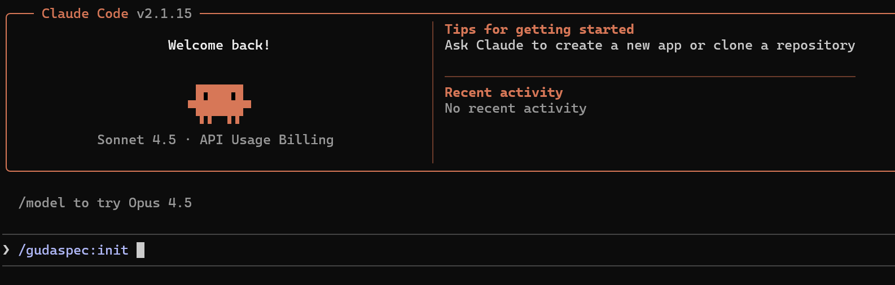

**0.2** claude会为您自动安装`openspec`，并检测`Codex-MCP` 和 `Gemini-MCP`是否可用。
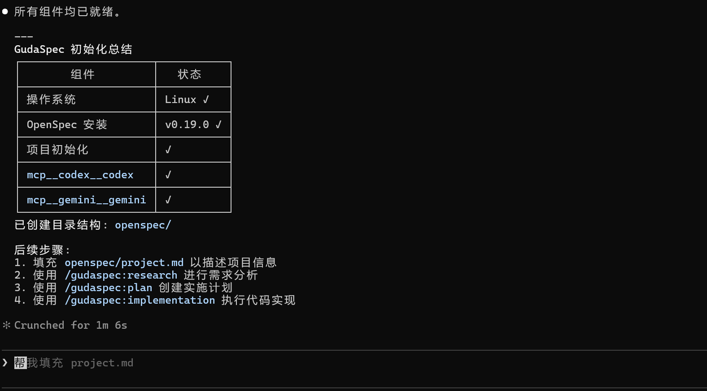

**0.3** 本阶段任务已完成，键入`/clear`，清空当前上下文并新开对话。

### 1. Research 需求研究
该阶段旨在根据项目的已有代码/掌握的初步信息，对用户的需求进行初步理解，并形成标准OpenSpec文档。

**1.1** 在新的会话窗口中输入以下内容：
```
/gudaspec:research
我需要生成一个美观的实时天气展示页面。要求：
  1. 实时天气信息必须为真实信息，包含温度、湿度等
  2. 用户可以选择北京、上海、深圳三个城市
  3. 四种不同的基础天气（大风、降雨、晴天、下雪），有不同的页面展示。
  4. UI设计极具美感，参考苹果公司的顶级前端设计。
```
claude会帮您自动调研并生成openspec格式的初步提案。
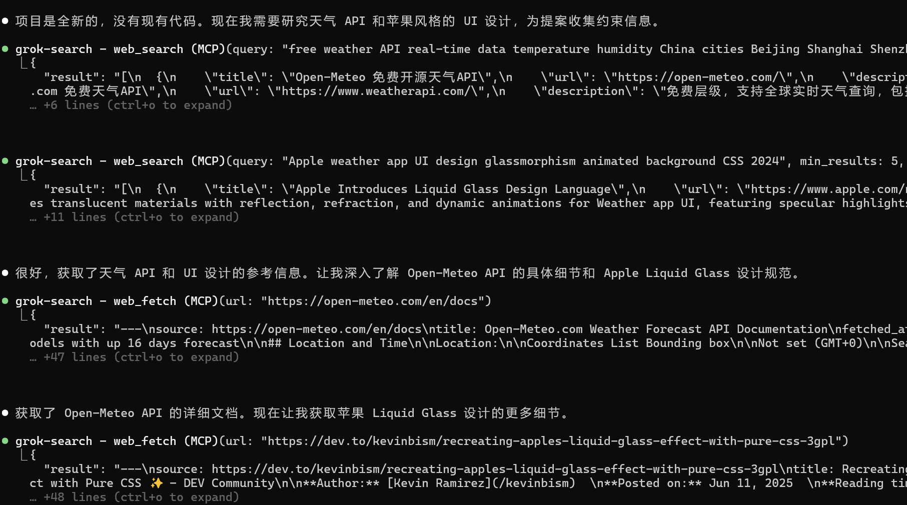
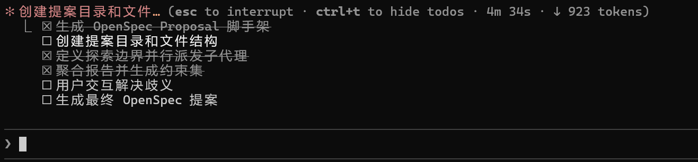

**1.2** 当您的需求中含有明显歧义时，claude会主动征求您的意见。
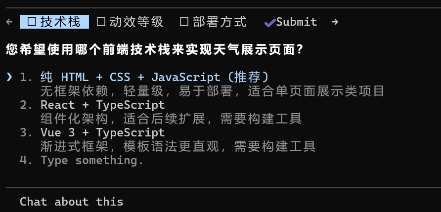

**1.3** 最终claude会为您生成初步的spec文档，此时只用了*59.5K*上下文，距离**claude的最专注上下文长度80K**还有不少距离。🥳
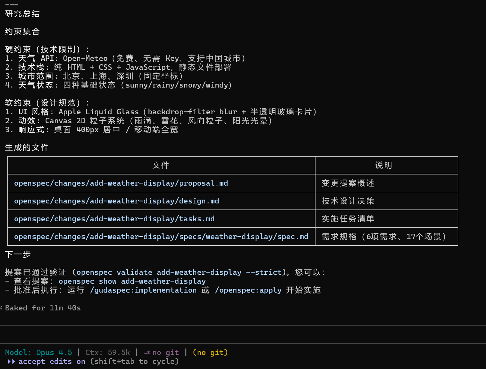

### 2. Plan 计划制定
本阶段的任务是彻底消除用户需求中的不确定性，并生成可执行计划。同时为计划提供可验证属性。

**2.1** 在新的会话窗口中输入以下内容，claude会自动帮您找到待完成的需求。
```
/gudaspec:plan
```
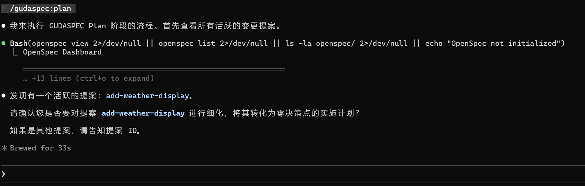

**2.2** claude会启动多模型（codex/gemini）协作，来对初步需求报告中的实现方案进行分析细化。
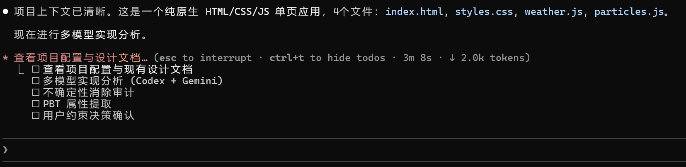

**2.3** 获取到多模型的分析方案后，claude会进一步细化需求，彻底消除技术上的模糊性。
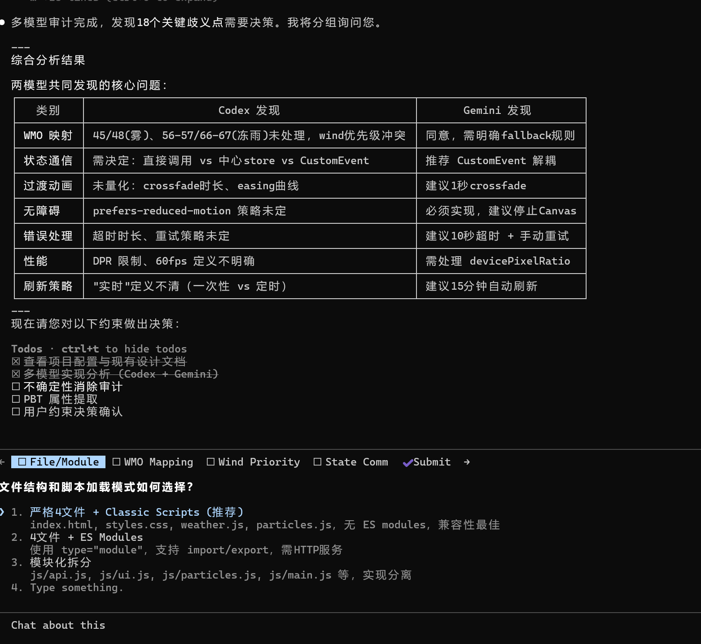

**2.4** 在所有决策项完成后，claude会提取 Property-Based Testing 属性，供后续阶段验证使用。
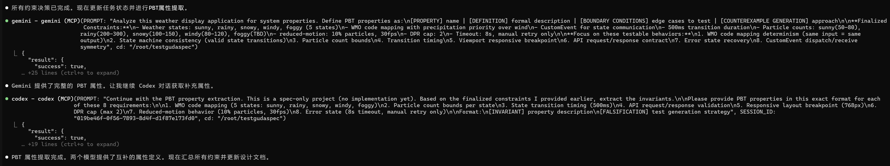

**2.5** 直至计划方案变成后续可零决策顺序执行的pipeline，claude会生成完整的spec文档，该阶段任务完成，输入`/clear`，清空当前上下文，新开会话窗口。
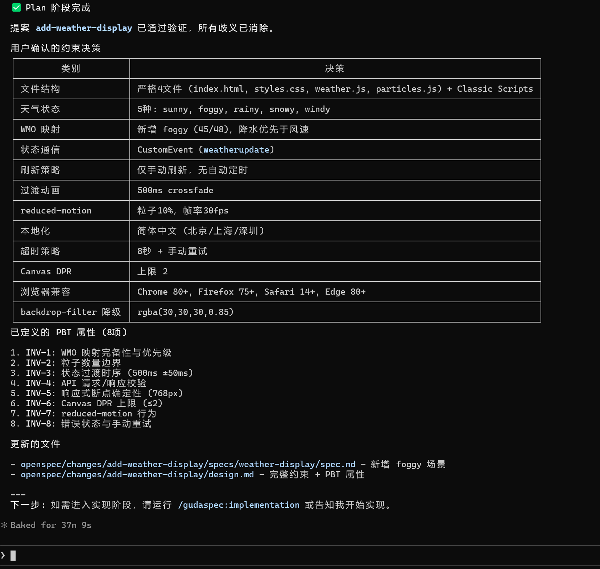

### 3. Implementation 代码实现
本阶段的目标是执行具体的代码实现，直至完成用户需求。

**3.1** 在新会话窗口中，执行以下命令，claude会自动帮您识别待完成的需求提案。
```
/gudaspec:implementation
```
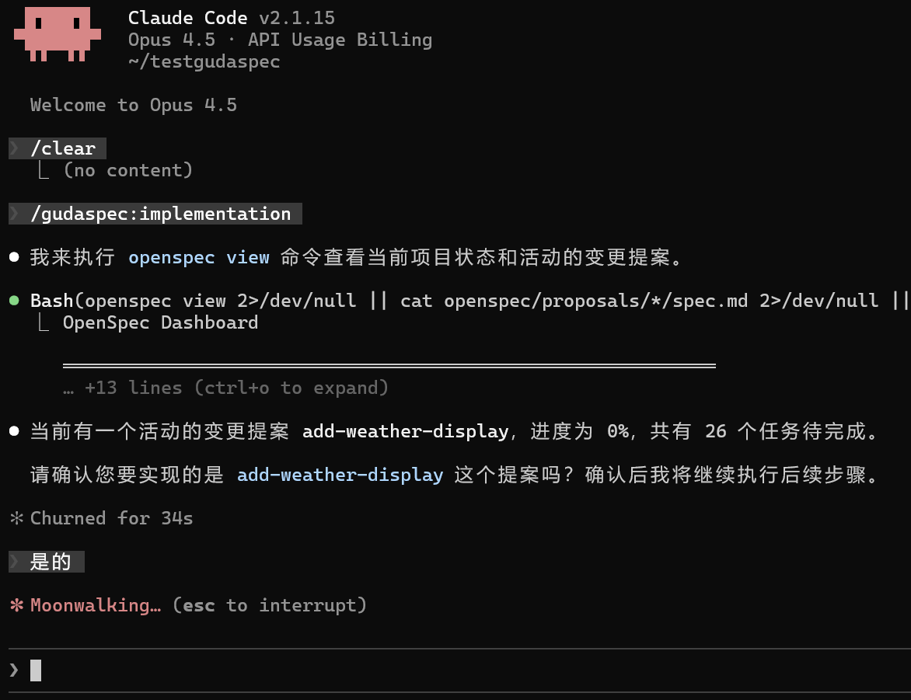

**3.2** claude会自动识别最小可验证任务来进行逐步实现，以更好的**帮助您控制上下文！**
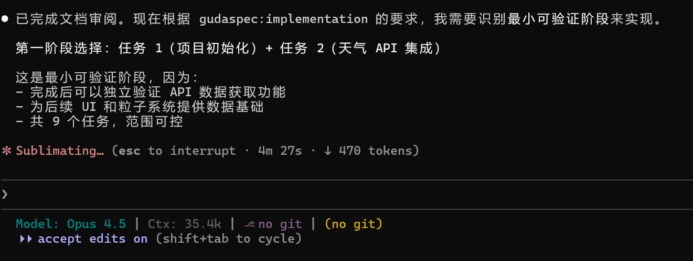

**3.3** 在完成一阶段任务后，claude会暂停询问您是否继续的意见，此时我们**强烈建议**您关注上下文窗口，**若小于80k则可以继续下一阶段的实现**；反之，可以输入`/clear`新开会话窗口，从**3.1**继续实现。
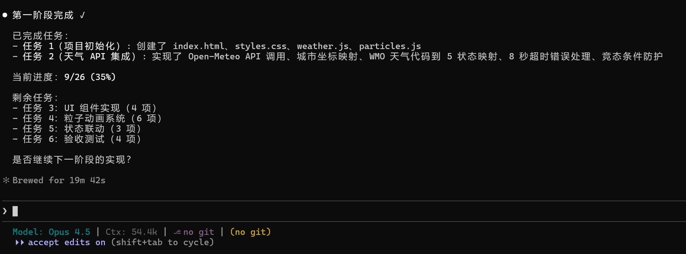

**3.4** 过程中，claude会自动启用多模型代码原型获取（前端/UI → Gemini | 后端/逻辑 → Codex），并在每完成一阶段任务后启用多模型review来保证代码可靠性。
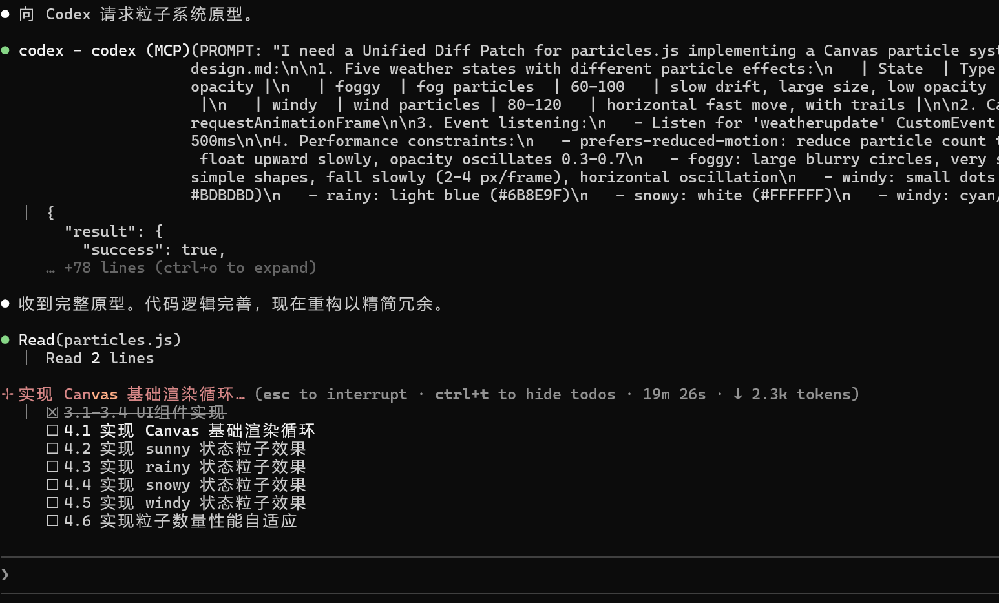

**3.5** 成果展示。直至所有任务完成，我们就可以获得一个拥有真实数据的天气系统啦！😀(左侧为系统截图，右侧为中央气象台截图)
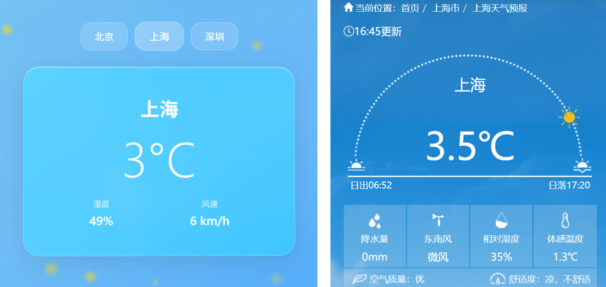


---

## FAQ

<details>
<summary>Q1: 什么是 OpenSpec？</summary>

OpenSpec 是一个规范化的需求-实现工作流框架，通过结构化的约束集管理，确保从需求到代码的可追溯性和一致性。

</details>

<details>
<summary>Q2: 必须安装 Codex/Gemini MCP 吗？</summary>

不是必须的。但若要使用完整的多模型协作功能，需要安装对应的 MCP 工具。运行 `/gudaspec:init` 会检测并提示安装。

</details>

<details>
<summary>Q3: 约束集有什么作用？</summary>

约束集将需求转化为具体的技术限制条件，消除实现阶段的决策点。每个约束都缩小解空间，使实现阶段成为纯机械执行，无需即时判断。

</details>

---

## 许可证

本项目采用 [MIT License](LICENSE) 开源协议。

Copyright (c) 2025 [guda.studio](mailto:gudaclaude@gmail.com)

---

<div align="center">

## 用 🌟 为本项目助力~

</div>

